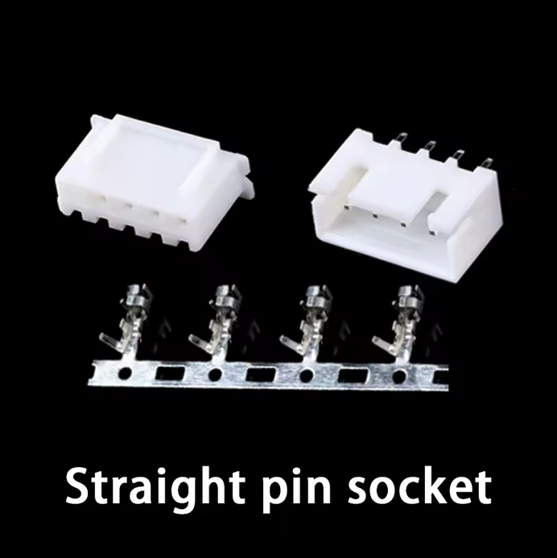
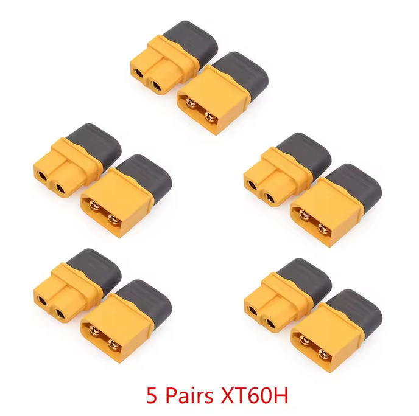
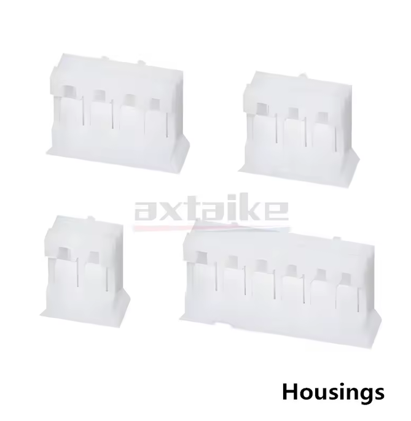
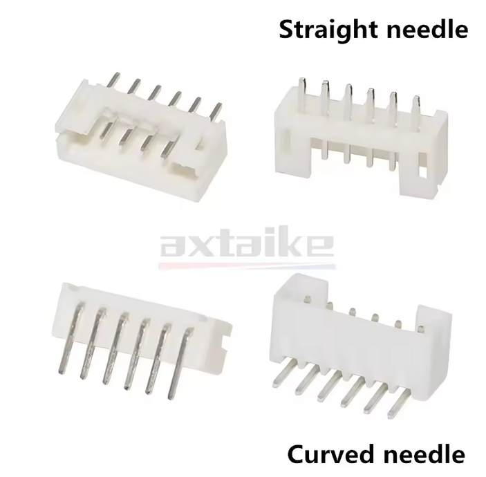

# Bill of Materials (BOM)

## Mechanics

| Name | Qty | Description | Comments | Suggested link | Image |
|------|-----|-------------|----------|----------------|-------|
| Steel ball | 12 | Ø1 mm (0.04") | Precision G10 or better. Can be sourced from small ball bearings | |
| PU stretch cord | 1 m | Ø1mm | e.g. "Stretch Magic" or "Magic String" | [Aliexpress](https://www.aliexpress.us/item/3256805953910514.html)| |
| Neodym Cylinder Magnet | 70 | Ø3mm h=5 mm | N52 Grade | [NeoMagnets](https://www.buyneomagnets.com/p/3mm-dia-x-5mm-thick-n52-neodymium-rare-earth-disc-magnets-100-pack/)|
| Brass Pipe | 1 m | OD=Ø2mm ID=Ø1 mm |  | [Amazon](https://a.co/d/1pRFmtf)| |
| M2-8 dowel     | 9   |             |          |                |       |
| SHCS M2-8      | 9   |             |          |                |       |
| Set Screw M3-6 | 3   |             |          |                |       |
| FHCS M3-6      | 3   |             |          |                |       |
| FHCS M3-10     | 9   |             |          |                |       |
| FHCS M3-20     | 12  |             |          |                |       |
| Crimp Beads    | 12  |             | Used to affix the ends of the PU cord |  |       |
## Electronics

| Name | Qty | Description | Comments | Suggested link | Image |
|------|-----|-------------|----------|----------------|-------|
| DC-DC Step Down Module | 1 | 4.75–23 V Step-Down Buck Converter |  | [Aliexpress](https://www.aliexpress.us/item/3256806752772875.html)| |
| (1N5819) OR (PMEG4010) | 1 | Diode (through-hole or SMD) |  | |
| Raspberry Pi Pico 2 | 1 | Microcontroller board |  | | |
| MT6835 Magnetic Encoder Module | 3 | Magnetic encoder |  | [Aliexpress](https://www.aliexpress.us/item/3256808005140674.html)| |
| TB6612FNG Driver | 3 | |  | [Aliexpress](https://www.aliexpress.us/item/3256806060073976.html)| |
| 470 µF Electrolytic Capacitor | 3 | > 100 µF | anything > 100µF will work well | |
| 10 µF Ceramic Capacitor 0603 | 3 | Optional |  | |
| 4.7 k Resistor 0603 | 2 | Optional |  | |
| NEMA 17 Stepper Motor | 3 | Body ≤ 38 mm | Body length <= 38mm | |
| JST XH2.54 4P connector | 3 | 4P Housing & Header 2.54mm pitch | J1, J2, J3 (motors) | [Aliexpress](https://www.aliexpress.com/item/1005007080333485.html?spm=a2g0o.order_list.order_list_main.53.3d5d1802JZg5Wb) |  |
| XT60H Connector | 1 | 2P Male & Female pair 7.5mm pitch | Power connector | [Aliexpress](https://www.aliexpress.com/item/1005007605928815.html?spm=a2g0o.order_list.order_list_main.409.3d5d1802JZg5Wb) |  |
| PH2.0 4P Housing   PH2.0 8P Housing | 1   1 | 4P 2mm pitch Housing   8P 2mm pitch Housing | J5 (tool/I2C)  J4 (encoders) | [Aliexpress](https://www.aliexpress.com/item/1005010491403413.html?spm=a2g0o.order_detail.order_detail_item.3.2b60126a5SMahl) |  |
| PH2.0 4P Header   PH2.0 8P Header | 1   1 | 4P 2mm pitch Header   8P 2mm pitch Header | J5 (tool/I2C)   J4 (encoders) | [Aliexpress](https://www.aliexpress.com/item/1005010491403413.html?spm=a2g0o.order_detail.order_detail_item.3.2b60126a5SMahl) |  |
## PCBs

| Name                | Qty | Description | Comments | Image |
| ------------------- | --- | ----------- | -------- | ----- |
| Control Board       | 1   |             |          |       |
| balljoint_plate_pcb | 6   |             |          |       |

## 3D Printing

| Name                | Qty | Description | Comments                                                        | Image                                              |
| ------------------- | --- | ----------- | --------------------------------------------------------------- | -------------------------------------------------- |
| Motor Horn          | 3   |             | 0.4 mm+ nozzle may require post-processing                      |                 |
| RubberBandCollet    | 12  |             | 0.4 mm nozzle, 0.1mm Layer height + may require post-processing |  |
| Motor Mount         | 3   |             |                                                                 |               |
| End Effector        | 1   |             |                                                                 |             |
| Base Block          | 1   |             |                                                                 |                 |

# Tool - Rod Sharpener

## 3D Printing

| Name          | Qty | Description | Comments | Image |
| ------------- | --- | ----------- | -------- | ----- |
| Rod Guide     | 1   |             |          |       |
| Blade Carrier | 1   |             |          |       |

# Tool - Rod Length Setting Press

## PCBs

| Name                    | Qty | Description | Comments | Image |
| ----------------------- | --- | ----------- | -------- | ----- |
| ball_alignment_disc_pcb | 1   |             |          |       |

## 3D Printing 

| Name                    | Qty | Description | Comments | Image |
| ----------------------- | --- | ----------- | -------- | ----- |
| RodGrindingJigA         | 1   |             |          |       |
| RodGrindingJigB         | 1   |             |          |       |
| RodGuide                | 1   |             |          |       |
| RodCollet               | 2   |             |          |       |
| CaliperClamp            | 2   |             |          |       |
